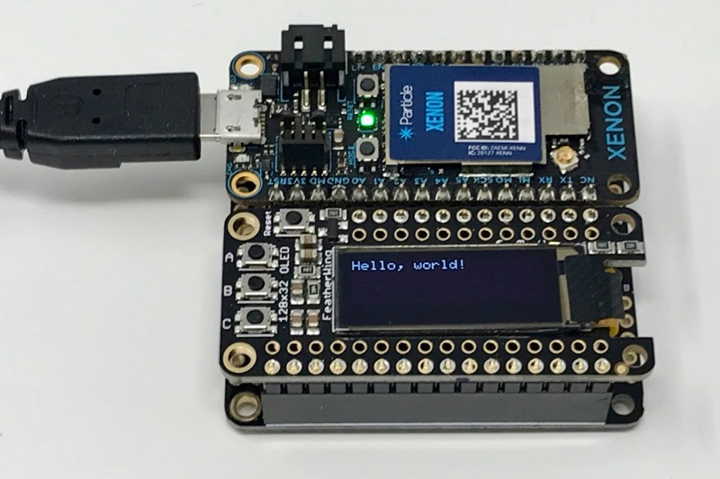

# oled-wing-adafruit


*Driver for Adafruit feather wing with SSD1306 oled and buttons*



The [Adafruit OLED FeatherWing](https://www.adafruit.com/product/2900) has a 128x32 OLED display and 3 buttons. You can find more technical information [at Adafruit](https://learn.adafruit.com/adafruit-oled-featherwing/overview).

It's handy because you can put an Argon, Boron, or Xenon in a FeatherWing doubler or tripler with the display and not have to worry about any loose wires!

## Using it

Using it is easy!

```
#include "oled-wing-adafruit.h"

OledWingAdafruit display;

void setup() {
	display.setup();

	display.clearDisplay();
	display.display();
}

void loop() {
	display.loop();

	if (display.pressedA()) {
		display.clearDisplay();

		display.setTextSize(1);
		display.setTextColor(WHITE);
		display.setCursor(0,0);
		display.println("Hello, world!");
		display.display();
	}

	if (display.pressedB()) {
	}

	if (display.pressedC()) {
	}
}
```

The important things are:

- Declare an object for the display:

```
OledWingAdafruit display;
```

- Call the setup method from setup()

```
	display.setup();
```

- Call the loop method from loop()

```
	display.loop();
```

- Use the methods to determine if the button is pressed. The buttons are debounced for you.

```
	if (display.pressedB()) {
		// Put some code here
	}
```

The display drawing commands use the [Adafruit GFX library](https://github.com/adafruit/Adafruit-GFX-Library), which supports text, graphics primitives (lines, circles, etc.) and bitmaps. The [example code](https://github.com/rickkas7/Adafruit_SSD1306_RK/blob/master/examples/simple/simple.ino) may be helpful.


## Revision History

### 0.0.8 (2020-12-18)

- Upgraded to Adafruit_SSD1306_RK 1.3.2 to fix a compilation error with Device OS 2.0.0

#### 0.0.7 (2019-12-10)

- Added mutex and lock methods for display usage on multiple threads

 

